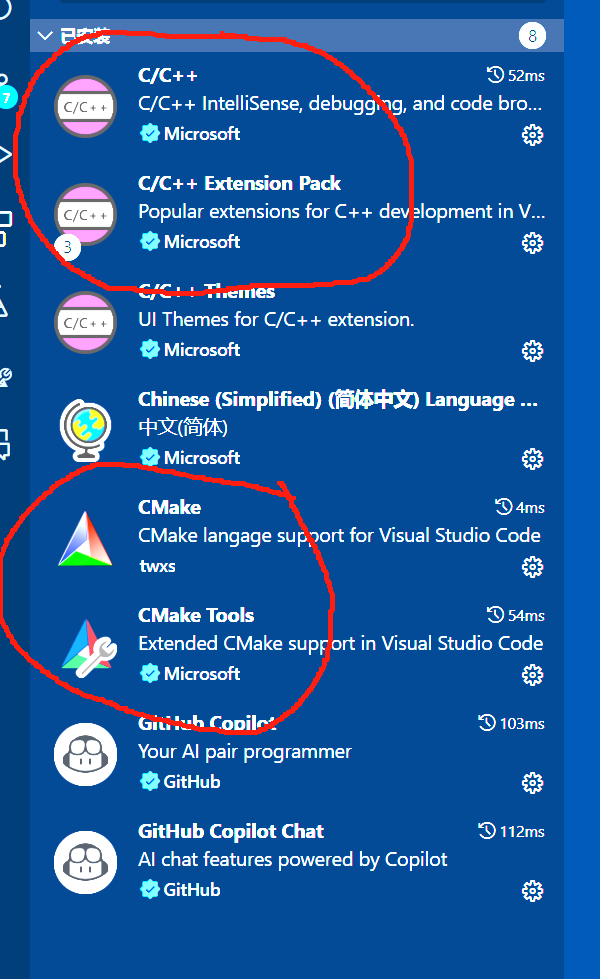

编译项目的方法：
1.下载git
2.在项目目录下创建out目录
3.在out目录下运行命令行，执行git clone https://github.com/microsoft/vcpkg
4.执行cd vcpkg
5.执行bootstrap-vcpkg
6.使用vs code打开项目文件夹，vs code需要安装4个插件

7.引来的boost库太大，cmake自动拉取可能失败，如果失败了继续在out/vcpkg目录下运行控制台，执行vcpkg install